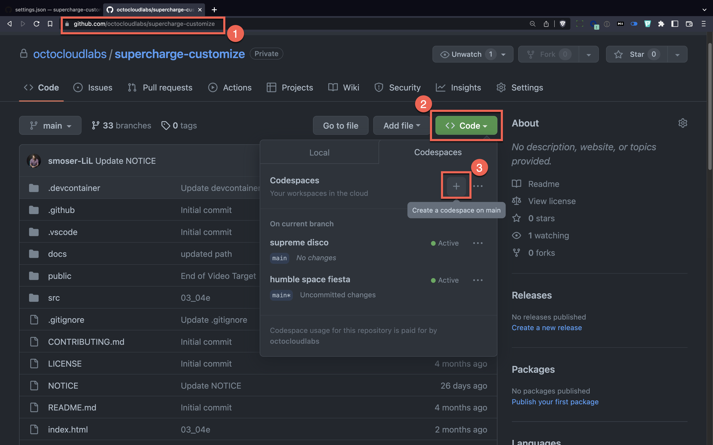
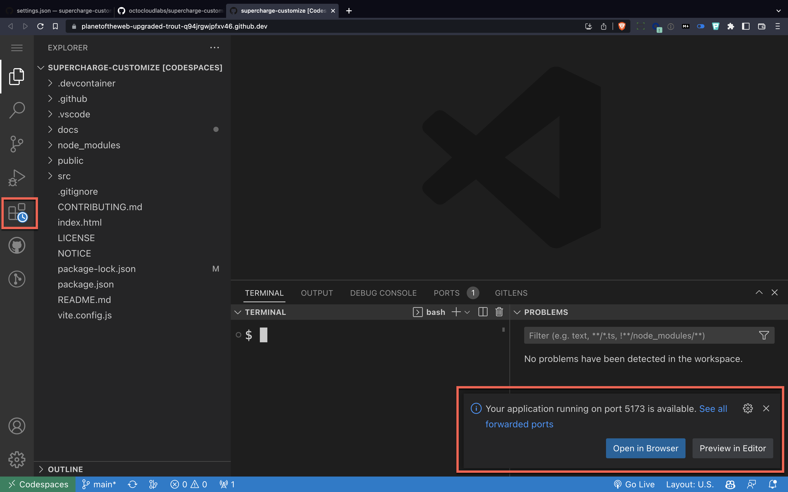
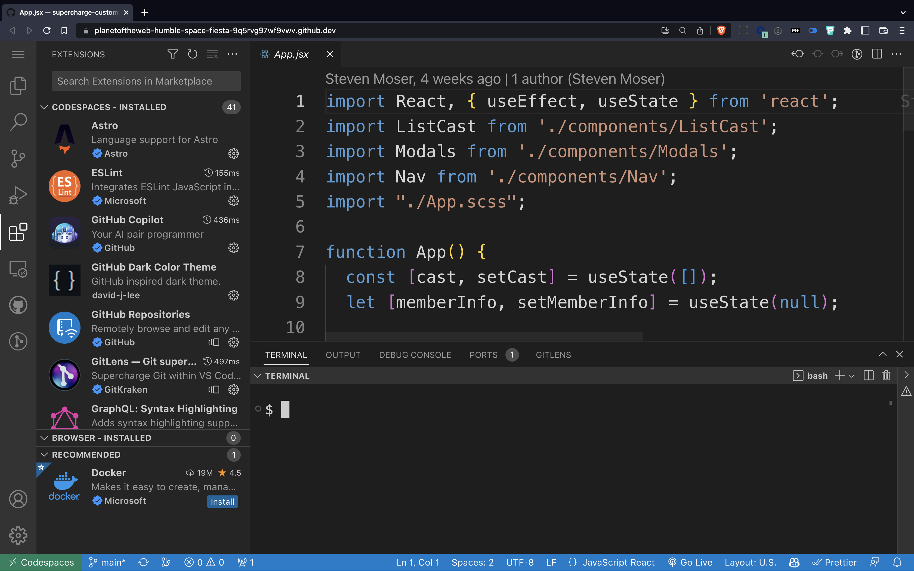

# Understanding Codespaces

In this section, you'll learn how to customize your workspace to your needs, you'll also learn a little about the structure of how we create our own courses at LinkedIn Learning. You'll also learn how to use a great tool called [CodeTour]( https://marketplace.visualstudio.com/items?itemName=vsls-contrib.codetour).

---

## Our Settings

 
### Exercise

1. Make sure you open the repository for this section called [supercharge-customize](https://github.com/octocloudlabs/supercharge-customize).
1. Click on the green Code button
1. Click on the plus icon to create a codespace in the main branch.

---

## Warnings

It might take a while for the codespace to finish loading. Often, it's because extensions have to be loaded, so keep an eye out for the clock icon as well as small popups, which you can safely ignore.

---

## Take a Look Around

First, it might not look like your current installation of Visual Studio Code. The theme might be different, the font sizes might be larger. 

You might also notice some extra extensions have been loaded. If you look carefully at the terminal prompt, it's been modified to be shorter.

### Exercises

1. Look for the `settings.json` file in the `.vscode` folder.
1. Click to open the file and take a peek at a sample settings file.
1. Look for the `devcontainer.json` file in the `.devcontainer` folder.
1. Click to open the file and take a peek at a sample devcontainer file.

[Go to next lab section](/ray/lab-2.html)