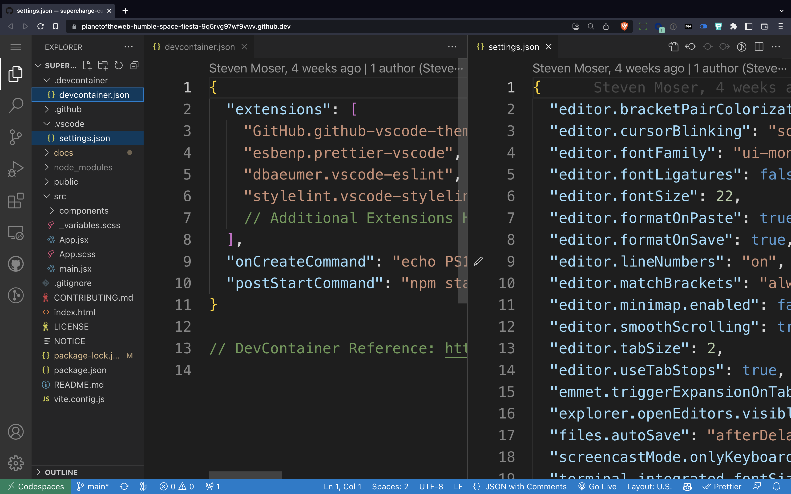

# How we Structure Repositories for Training

We deliberately modify the state of the copy of Visual Studio Code to make the recording and playback experience more consistent. We do this in two places.

---

## Settings.json

First, we add a `.vscode/settings.json` file to our projects so that we can control the look and feel of the application.

---

## DevContainer

Second, we add a `.devcontainer/devcontainer.json` file to control how Codespaces loads the container, which extensions are preloaded and customize our command prompt.

---

## Zoom Ratio

Visual Studio Code has no way of controlling the size of the text in the primary bar (normally your file list), so we zoom our screens to about 140% with your browsers zoom in controls. 

Although that seems like a very large size for everything, it displays well on laptops and smaller screens for watching videos.

---

## Resolution

We generally record in HD mode (1920x1080) and try to use monitors with 2x density, so technically we can get a max 4k resolution in the recording. The zoom ration and the settings in the `.vscode/settings.json` file are adjusted for these settings.

Whatever you do, make sure the fonts are easy to read, even on a smaller screen.

---

## Recording Software

If you're curious, we've used a number of applications for recording over the years like [Camtasia](https://www.techsmith.com/video-editor.html), [ScreenFlick](https://www.araelium.com/screenflick-mac-screen-recorder), [iShowU](https://www.shinywhitebox.com/ishowu-instant) and [Screenflow](https://www.telestream.net/screenflow/overview.htm). 
