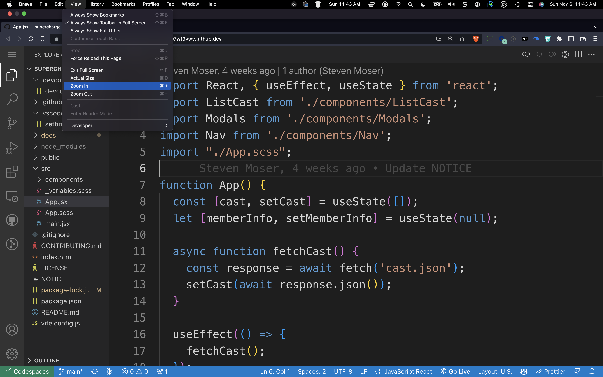

# Before we Record

Before we get technical, I wanted to give you an insight into how we prepare the course as well as the setup before we start recording. 

One of the things we try to manage is the experience. LinkedIn Learning Instructors deliberately modify the appearance of GitHub Codespaces to make the recording and playback experience more consistent. For recording videos, you should make your text large and visible so users can follow along clearly even on smaller screens.

---

## Preparation

Before we hit record, we go through a four step process:

### The Pitch

Even experienced instructors need to have a plan that outlines what you're going to cover. For us this goes through a pitch process where you describe to one of our content managers what you want to do. So your first step is to convince someone that the course you want to do is worthwhile.

### The Setup

Once a pitch has been approved, you go through a process of outlining the course and making sure you think about what you want users to learn for each video.

### The Prep

We teach different types of courses. Sometimes, we do a course where we build a small app or product, sometimes, it's more conceptual, so during the prep, we build the demo that we want viewers to do.

This is where the majority of the work goes in, we write out what we want to do for each video in detail. Most of what we do is not recording, it's writing.

### The Record

By the time you get to recording, you've done most of the work. We use a variety of tools to record. If you were building a course for us, you'd have a producer that coaches and to you while you're recording. They handle the scheduling and manage your course through the process.

By the way, if you're interesting in recording something for us, come chat with us after the session. 

Now let's get into a bit of the setup.

---

## Controlling the Presentation

It's real important that you provide a good experience for the learner and one of the keys to that is making sure things are visible. Visual Studio Code has no way of controlling the size of the text in the primary bar.

LinkedIn has standardized on about 140% with your browser zoom controls.

Although that seems like a very large size for everything, it displays well on laptops and smaller screens for watching videos.

---

## Resolution

We generally record in HD (1920x1080) and try to use monitors with 2x density, so we can get a max 4k resolution in the recording to improve clarity and allow for zooming in if necessary.

The font size and other settings in the `.vscode/settings.json` file are adjusted for these proportions.

[Understanding Repository Structures](/ray/lab-3.html)