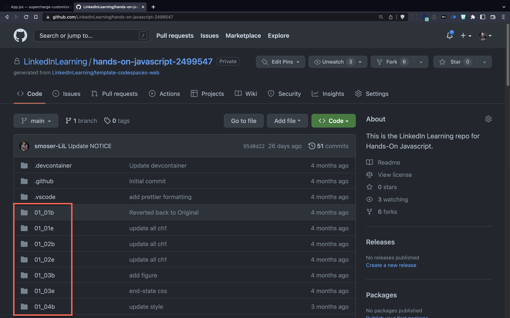

# Repository Structure

There are two ways we set up our repositories, flat file and multi-branch repositories.

---

## Flat File Repositories

With a flat file repository, all the files are in a single branch, and there are folders for each video in our courses. This works great for simple projects and languages where a flat file system makes it easier to navigate through a project.

You can see a sample of one of our [flat file]() course in our Hands-On: JavaScript course.

---

## Multi-branch Repositories

For sites that use build processes, like a lot of web projects we use one or two branches for each video in the course. We name our branches according to the chapter and the video number in the course.

So, for example if you find a branch called `01_03`, that branch would correspond to the first chapter and the third video in that chapter.

If you see a `b` at the end of a branch name `01_03b`, then that's how the code looks at the beginning of the video and if you see an `e` (as in `01_03e`) at the end, that's how the branch looked at the end of the video.