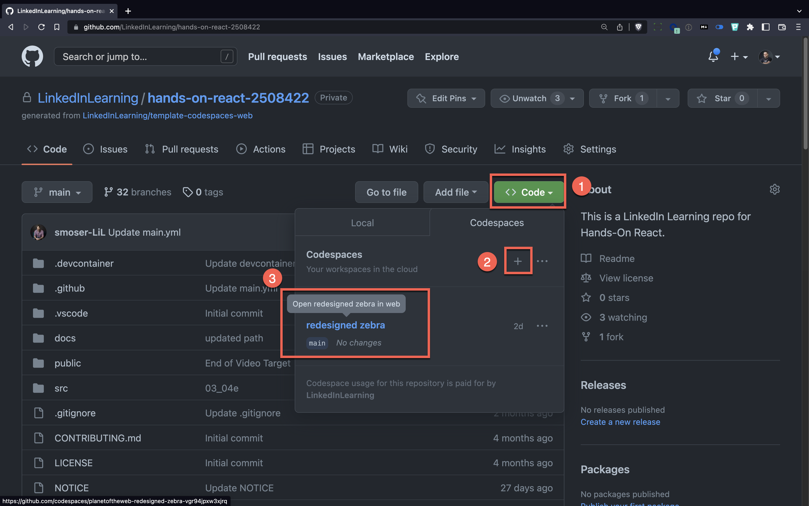
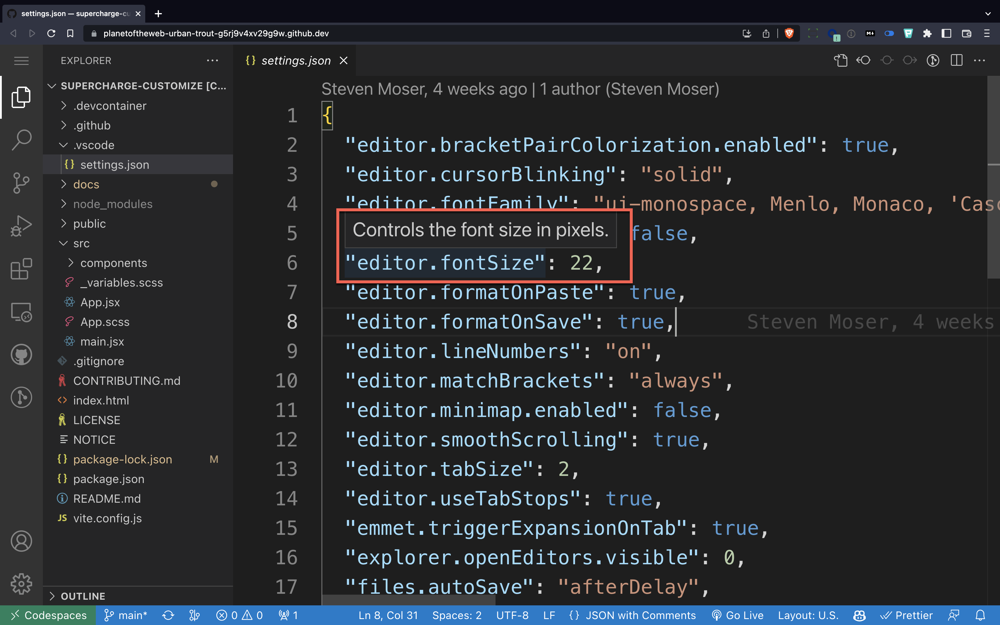
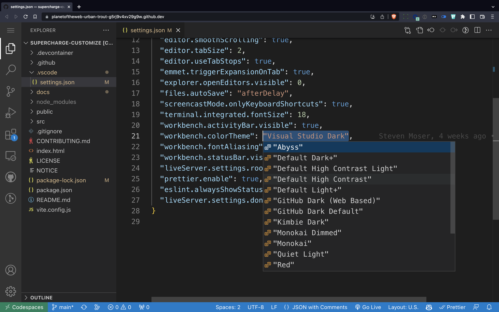
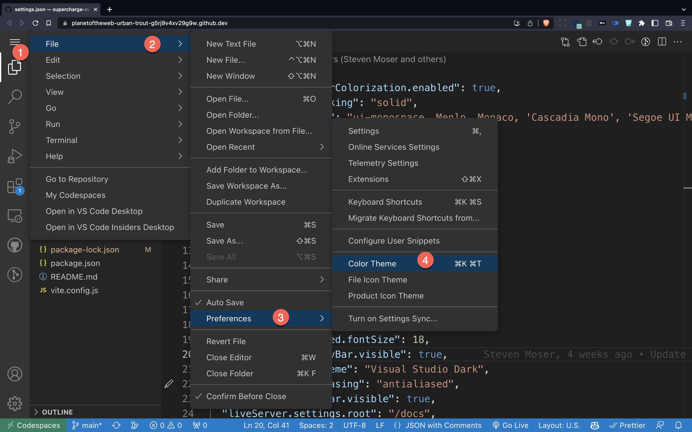
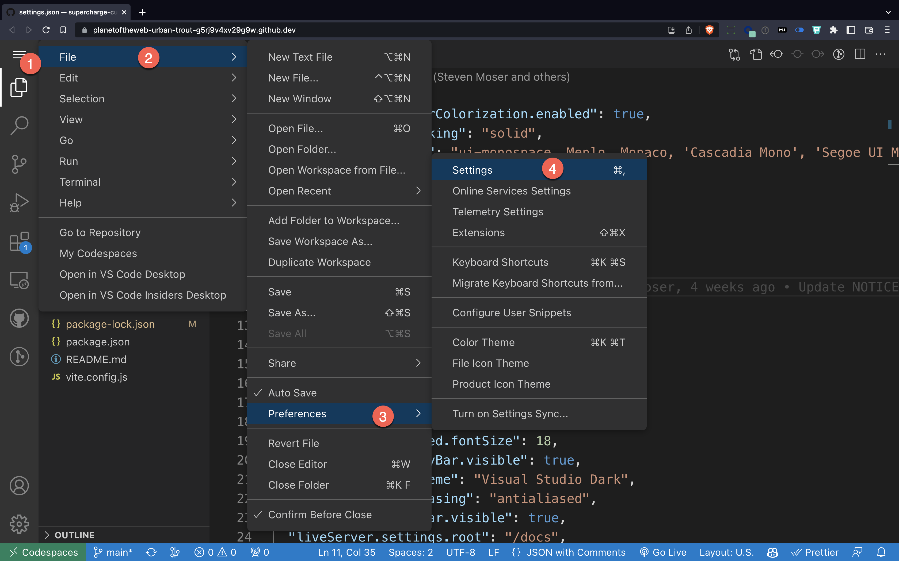
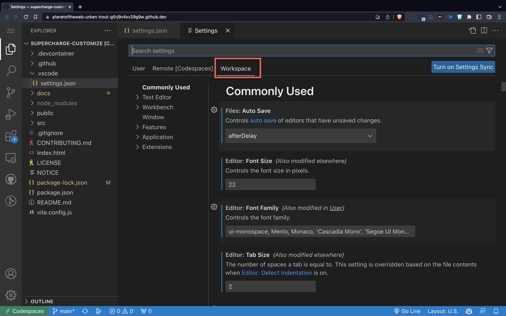

# Modifying Settings

If there's already a `settings.json` file in the `.vscode` folder, you can modify it to your liking. Let's try changing an existing file.

---

## Renaming a Codespace



When you stop actively working on codespace, it will go into sleep mode. 

You can create a new codespace, restart an existing codespace and renaming a codespace.

## Exercise
1. Close your existing codespaces
1. Go to the [supercharge-customize](https://github.com/octocloudlabs/supercharge-customize) repository. 
1. Click on the `Code` Button
1. Locate the Plus `(+)` button (2)
1. Notice the auto-generated name (3)
1. Click on the `...` button, then click on rename (4)
1. Type in a new name
1. Click on the codespace.

---

## Modifying the Settings

To make your codespace look a certain way, you can customize the `.vscode/settings.json` file. Let's try modifying the font size file for our codespace.



1. Open your codespace
1. Navigate to `.vscode/settings.json`
1. Find the line `"editor.fontSize": 22`
1. Change the value to `16`

It takes a second for the font to update. If you roll over the value on the JSON file, you'll get a description of what the setting does.

---

## Letting IntelliSense Help



If you want to modify a setting, but you're not sure what the options are you can let intellisense help you.

### Exercise
1. Select `"Visual Studio Dark"` including the quotes
1. Type `ctrl + space` to bring up intellisense
1. Choose another theme from the list

---

## By Modifying Menus

Sometimes, it's better to just modify the settings using the menus.



By changing the color theme here, notice that it changes the workspace settings as well.

---

## From Settings Menu



If you don't know the name of a setting, you can just go to the settings menu.



With this, you can have fine grained control over which version of the settings you're going to modify. My clicking on the workspace tab, you'll be affecting just this workspace, not your settings for other projects.

---

## Guaranteeing Settings

Settings will often be overriden by the user's own options, so sometimes you want to make sure a setting is turned on, even though the user might have turned it off.

`"workbench.activityBar.visible": true,`

Such is the case with the activity bar. I often try to save a few pixels while code, so for me it's off by default, but when I record, I want to make sure it's on.


## Default Settings

Just in case you're wondering, here's what the [default settings](https://code.visualstudio.com/docs/getstarted/settings#_default-settings) for Visual Studio Code look like.


## Settings Documentation

To learn more about settings, check out the [online documentation](https://code.visualstudio.com/docs/getstarted/settings)

## Our Defaults

After some deliberation, here are our default settings for future reference.

```json
{
  "editor.bracketPairColorization.enabled": true,
  "editor.cursorBlinking": "solid",
  "editor.fontFamily": "ui-monospace, Menlo, Monaco, 'Cascadia Mono', 'Segoe UI Mono', 'Roboto Mono', 'Oxygen Mono', 'Ubuntu Monospace', 'Source Code Pro', 'Fira Mono', 'Droid Sans Mono', 'Courier New', monospace",
  "editor.fontLigatures": false,
  "editor.fontSize": 22,
  "editor.formatOnPaste": true,
  "editor.formatOnSave": true,
  "editor.lineNumbers": "on",
  "editor.matchBrackets": "always",
  "editor.minimap.enabled": false,
  "editor.smoothScrolling": true,
  "editor.tabSize": 2,
  "editor.useTabStops": true,
  "emmet.triggerExpansionOnTab": true,
  "explorer.openEditors.visible": 0,
  "files.autoSave": "afterDelay",
  "screencastMode.onlyKeyboardShortcuts": true,
  "terminal.integrated.fontSize": 18,
  "workbench.activityBar.visible": true,
  "workbench.colorTheme": "Visual Studio Dark",
  "workbench.fontAliasing": "antialiased",
  "workbench.statusBar.visible": true,
  "liveServer.settings.root": "/docs",
  "prettier.enable": true,
  "eslint.alwaysShowStatus": false,
  "liveServer.settings.donotVerifyTags": true
}
```

[Go to next lab section](/ray/lab-5.html)