# Code Tour

Another way to enhance your tutorials is to provide an onboarding experience that is annotated. You can do that with an extension called [Code Tour](https://marketplace.visualstudio.com/items?itemName=vsls-contrib.codetour). You should have installed it in the previous lab.

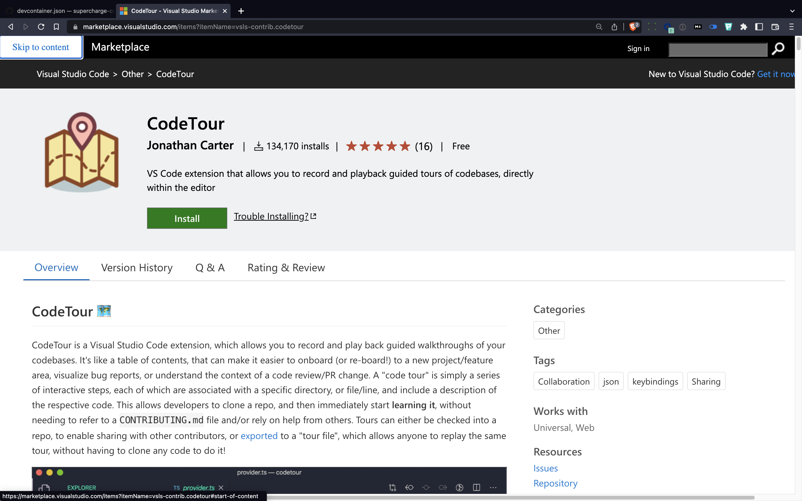

---

## Seeing Other Branches
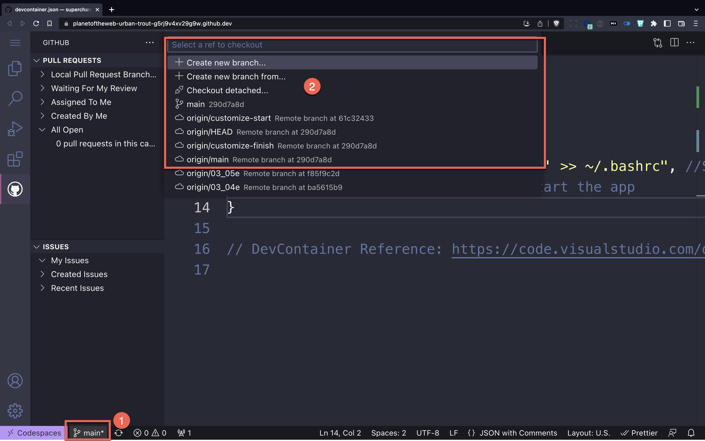

Although the repository has a lot of branches, the codespace doesn't have information about them by default. In order to see the other branches, you'll need to pull information about them.

### Exercise

1. Open the terminal
1. Run the command `git pull --all` 

---

## Open the `codetour` Branch

The CodeTour extension adds a tab at the bottom of your sidebar with some new features.

Let's go ahead and record a tour.

### Exercise

1. Click on the Plus icon in the CodeTour tab.
1. Type in `Walkthrough` for the name of the Tour

1. You can make a tour apply to every commit in a single branch or a single commit. Choose the branch option.
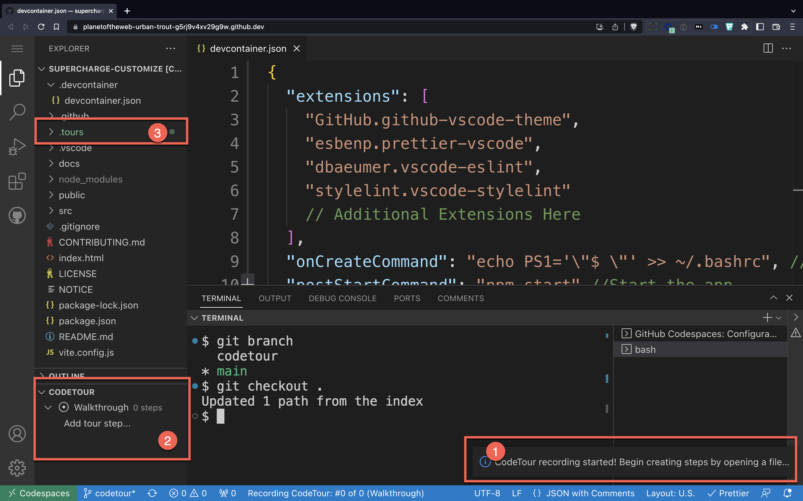
1. Notice the changes in the interface. You get a notice telling you that recording has started, The CodeTour tab tells you that it's ready for you to record a step and there is a new folder called `.tours`

1. Go to the index.html document
1. Roll over line 1 in the document, notice that there is a Plus sign next to the line number.
1. Click on the plus sign to add a step to the tour.
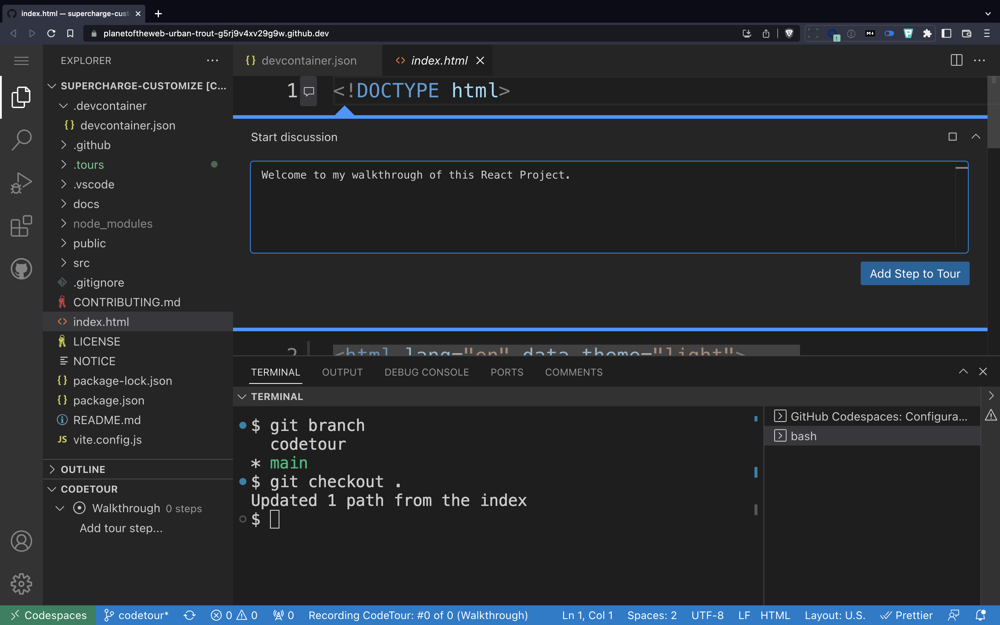
1. Add a welcome message.

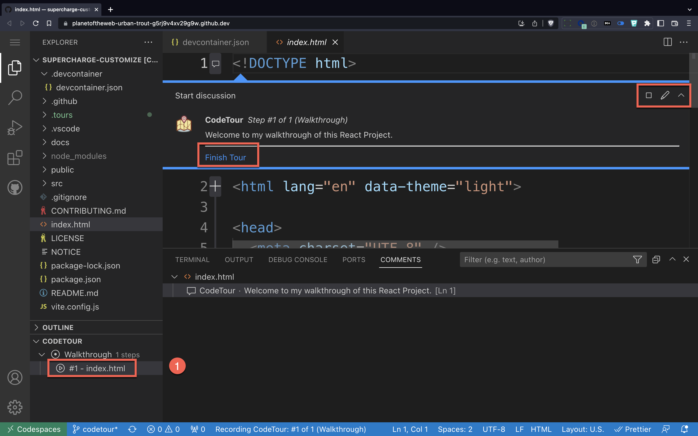

You'll notice that there's a new step on the tour and that your message was added to the file as a CodeTour popup. There are some new controls available.

Try clicking on the pencil icon to edit the message.

---

## Change the Line Number
You can also change the line number that the CodeTour popup appears on.

Roll over the message, then click on the three dots.

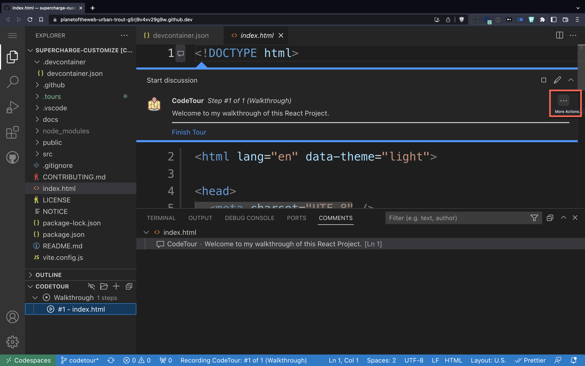

Now, you can type in the line number to assign this message to a new line. Since line 7 has the title of the document, type that and hit enter.

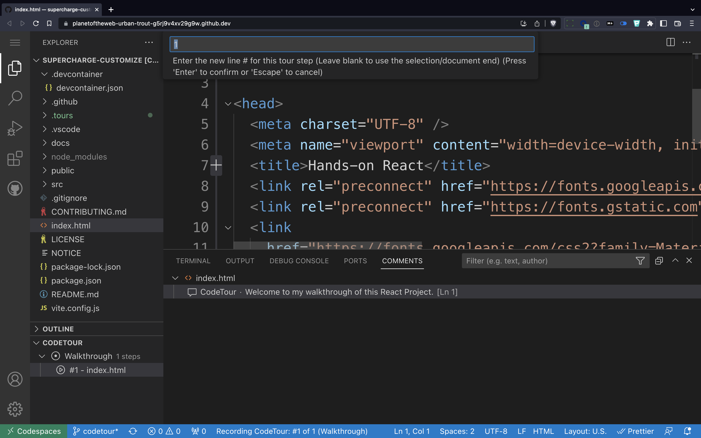

---

## Annotate Another File

You can add steps in the same file or another file.

1. In the src folder, open the `App.jsx` file.
1. Click on the plus sign next to line 1.
1. Add a message that says "The App.jsx file is the main component in our application."
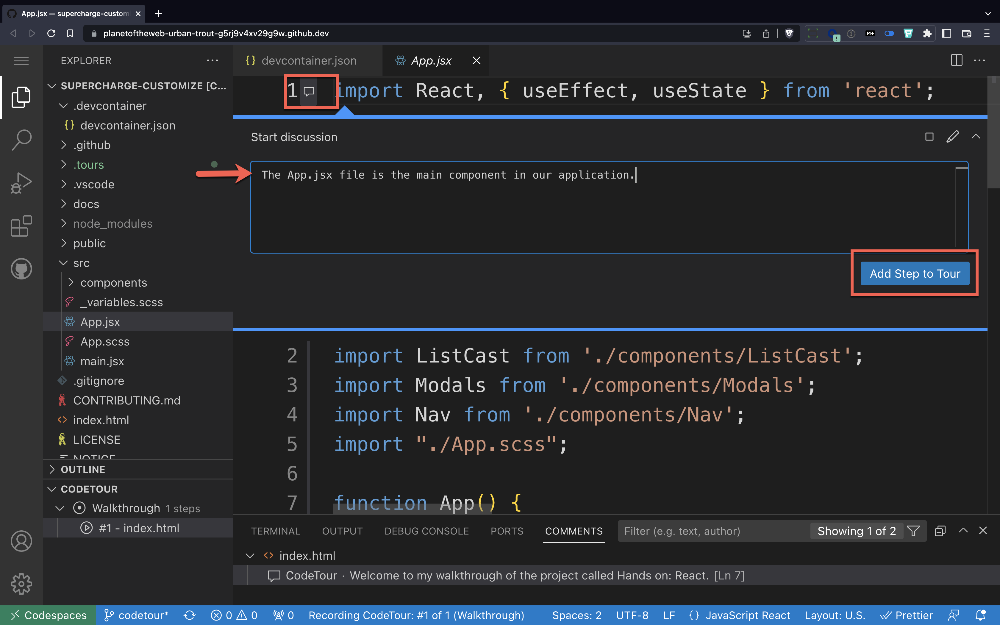

When you add this step, the tour shows you the second step and there is now a new arrow where you can navigate between your tour steps.

Use the arrows to go from one step to another. 

**Note:** Sometimes the annotations will collapse, look next to the line number for an icon to expand the annotation.

You can now also change the order the annotation appears in, either in the Code Tour tab or in the `...` menu. Try changing the order of the two steps.

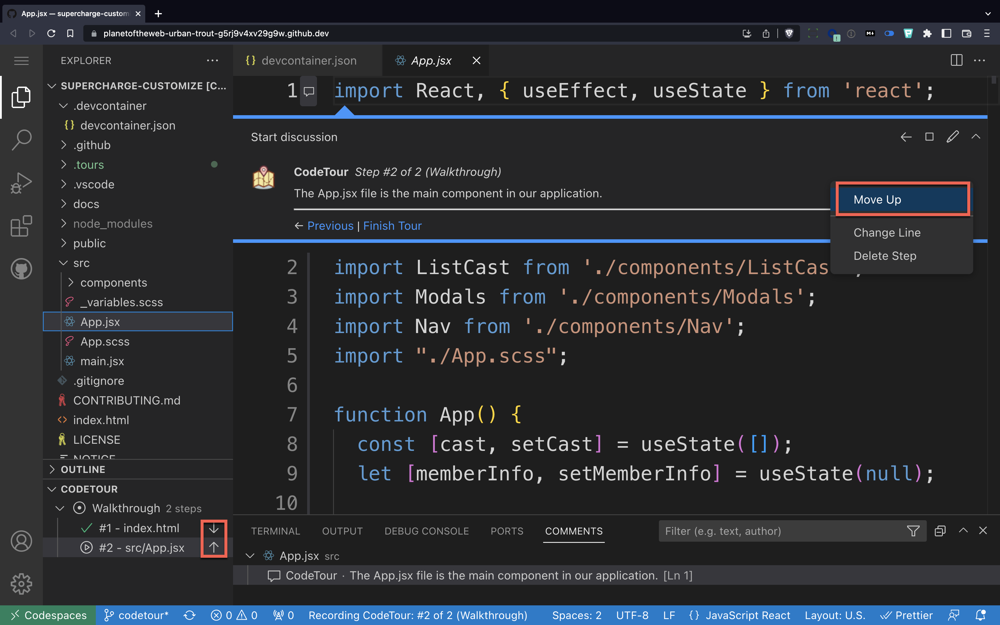

---

## Adding a Selection Block

You can also add an entire selection group as a step instead of a single line.

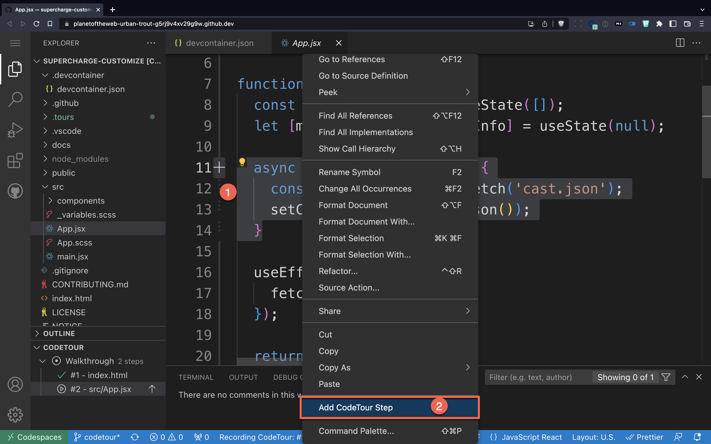

1. Select a few lines in the editor
1. Right click on the selection
1. Choose `Add CodeTour Step` from the menu

---

## Changing Titles

The automated titles aren't always the best, so you can change them. 

1. Right click on a step's title 
1. Change the title of the step

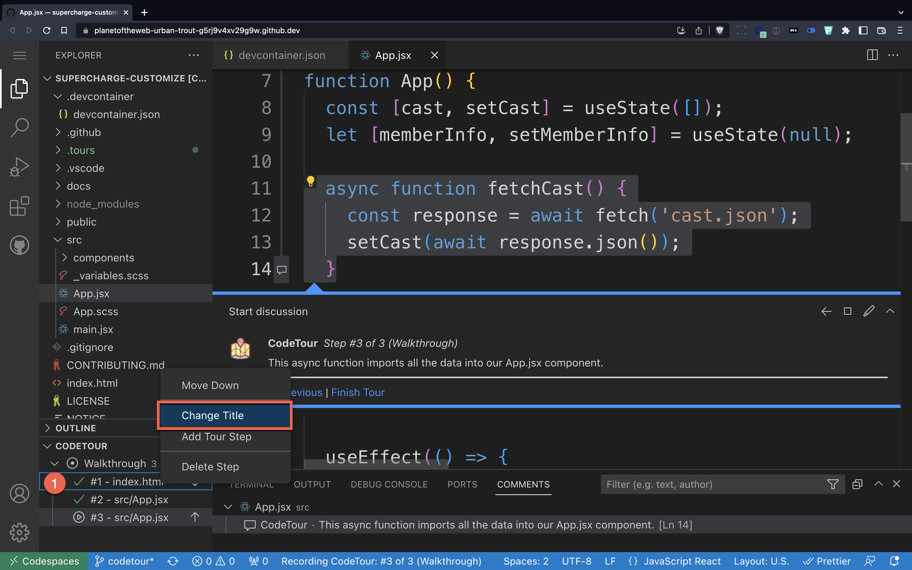

---

## Full Markdown Support

You have the full power of markdown inside the messages. You can add links, images, and even code blocks.

If you add a title `#` to the message, it will also become the title for the tour automatically.

---

### Exercise

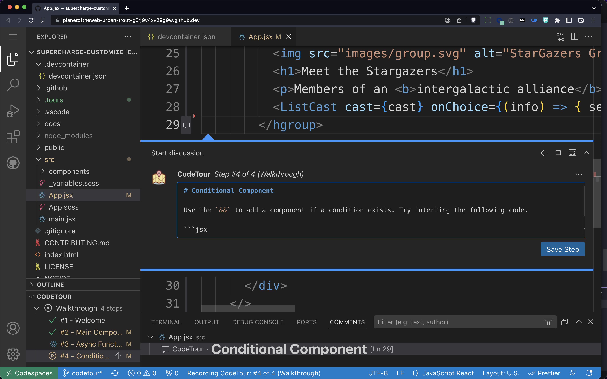

1. Select line 29 in the code
1. Cut the line into the clipboard
1. Add a new step on line 29
1. Start a code block with three backticks
1. You can add the language type next to the first backticks for syntax highlighting, so we can add `jsx` in this case
1. Paste the line you cut into the code block

---

## Insert the Code Block

We often ask students to type in some code, you can let CodeTour automatically insert some complex codeblocks into a line.

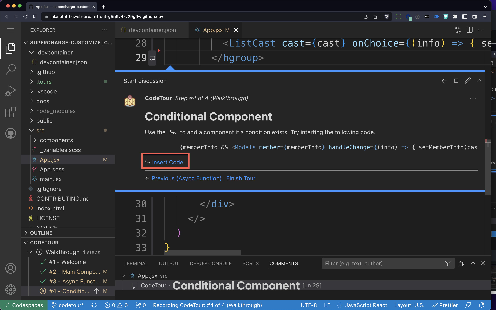

1. Pull up the current tour step.

Click on insert code.

---

## Finishing the Tour
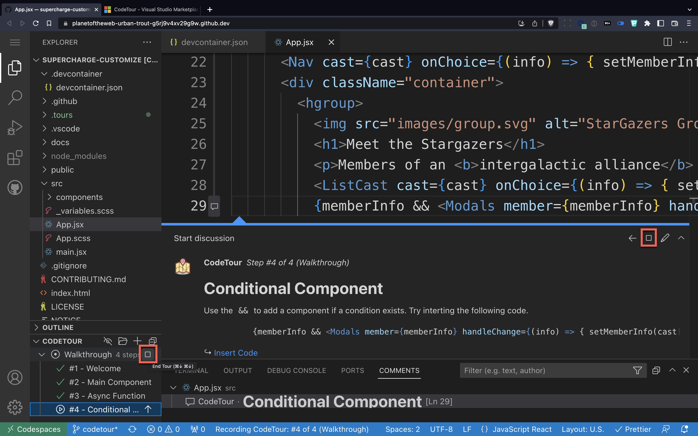

When you're done with a tour, you can use the `Finish Tour` button. Its available in several places in the interface.

---

## The Tour Files
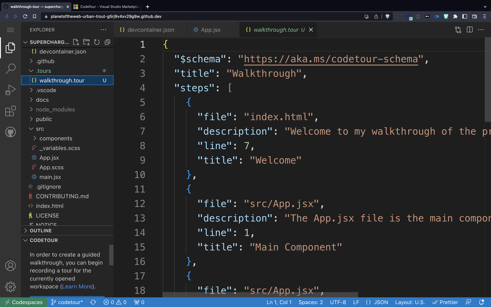
A tour is really just a json document inside a tours folder. You can take a peek at the file in the editor and modify it there. However, you might need to restart the tour to see changes.

---

## Other Features

Codetour has a lot of other features, including the ability to run terminal and other commands, run a series of commands to, for example, pull up a browser URL, set up tours that are inside other tours. For more information, check the [documentation](https://marketplace.visualstudio.com/items?itemName=vsls-contrib.codetour).

[Go to next lab section](/ray/lab-6.html)